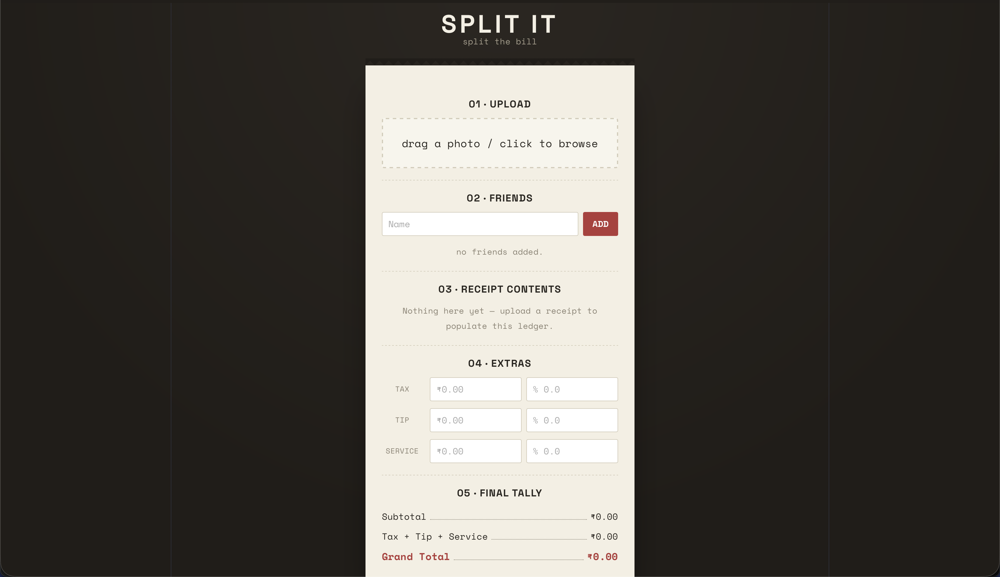
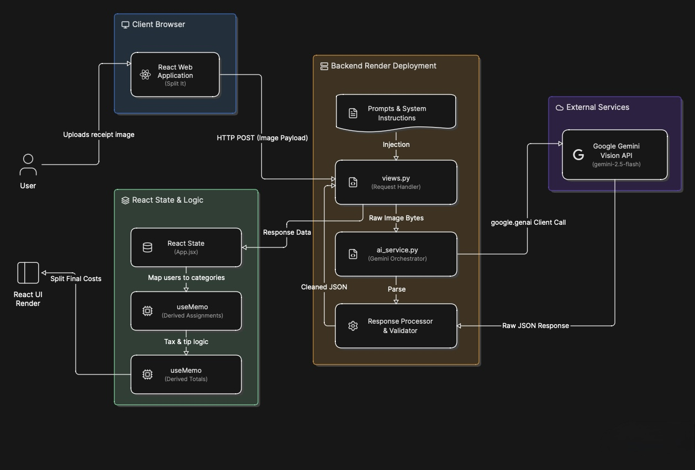

# Real-Split-It

Splitting a restaurant bill is always a hassle, especially when trying to calculate who ordered what and how to divide shared items fairly. Real-Split-It is an AI-powered receipt splitter that automates the entire calculation process using multimodal large language models. 

Users simply upload a picture of their receipt, and the application instantly extracts the items, categorizes them, and calculates proportional splits for every person at the table.

## User Interface

## Core Features

*   **Multimodal AI Extraction:** Upload a raw receipt photo, and the backend leverages the Google Gemini Vision API to instantly extract text and parse it into heavily structured JSON.
*   **Algorithmic Categorization:** The prompt architecture forces the LLM to classify items into granular categories (Beverages, Alcohol, Staples, Veg). Shared table items, such as mineral water or appetizers, are automatically split across all users.
*   **Human-in-the-Loop UX:** The dynamic React interface allows users to override AI categorizations via inline dropdowns. Utilizing React hooks like `useMemo`, any manual tag change instantly recalculates the fractional math for the entire table without needing another API call.
*   **Proportional Tax and Tip Distribution:** Extra charges are calculated fairly. The math logic ensures that tax and tip are distributed proportionally based on each individual's subtotal footprint, rather than split evenly.

## System Architecture

The application is engineered as a decoupled full-stack system. The frontend handles state management and fractional math, while the backend acts as a stateless orchestrator for prompt engineering and AI communication.

### Technical Stack
*   **Frontend:** React, JavaScript (JSX)
*   **Backend:** Python, Django, Django REST Framework
*   **AI Integration:** Google Gemini Vision API (gemini-2.5-flash)
*   **Deployment:** Render

### Engineering Optimizations
The backend originally utilized a modular Optical Character Recognition (OCR) pipeline using OpenCV and EasyOCR to extract text before passing it to an LLM. 

This pipeline was completely replaced by a direct multimodal vision approach. By sending raw image bytes directly to the Gemini API, the application avoids explicit text extraction steps. This architectural shift allowed for the removal of heavy machine learning dependencies (including PyTorch, SciPy, and OpenCV), reducing the server deployment size by over 2 Gigabytes and significantly improving accuracy on crinkled or poorly lit receipts.

## Local Development Setup

To run this project locally, you will need Node.js and Python installed on your machine, along with a Google Gemini API key.

### Backend Setup
1. Navigate to the backend directory:
   `cd backend`
2. Create and activate a virtual environment:
   `python -m venv venv`
   `source venv/bin/activate` (Mac/Linux) or `venv\Scripts\activate` (Windows)
3. Install the optimized dependencies:
   `pip install -r requirements.txt`
4. Set up your environment variables. Create a `.env` file in the backend directory and add your API key:
   `GEMINI_API_KEY=your_api_key_here`
5. Start the Django development server:
   `python manage.py runserver`

### Frontend Setup
1. Open a new terminal and navigate to the frontend directory:
   `cd frontend`
2. Install the Node dependencies:
   `npm install`
3. Start the development server:
   `npm run dev`
